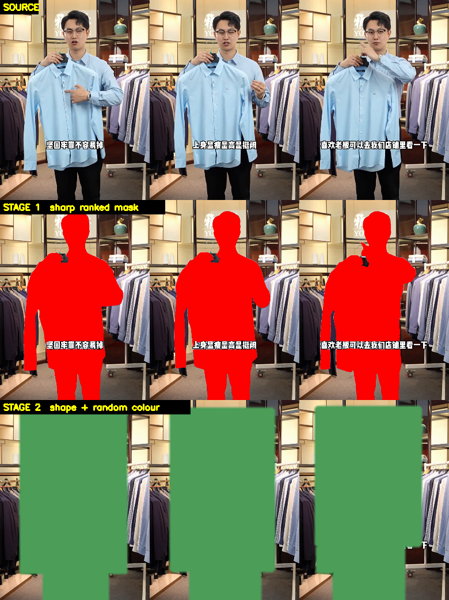
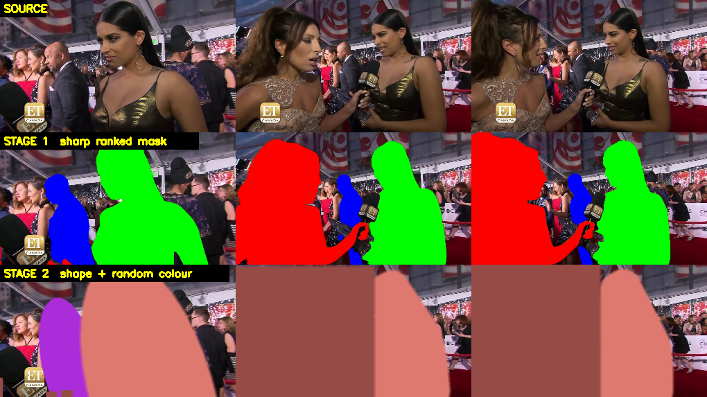
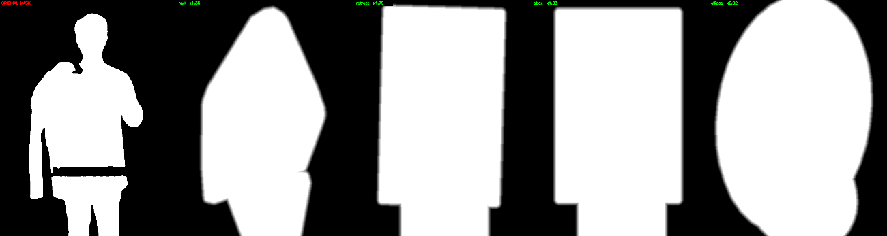
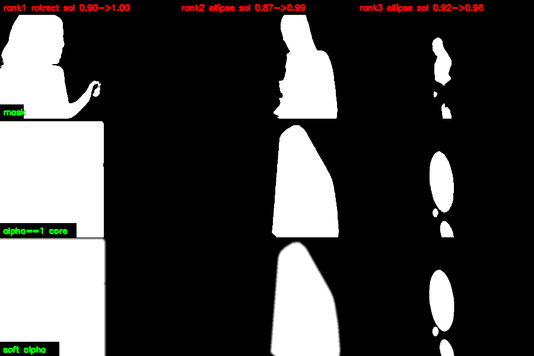
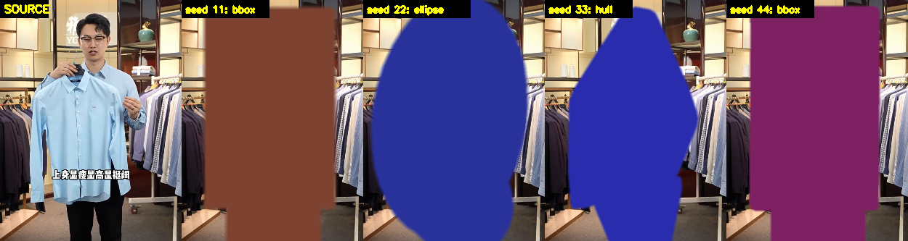
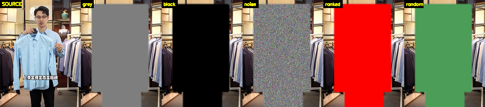

# video-subject-mask

**English** · [中文](README.zh-CN.md)

Find the subjects in a video, rank them by importance, segment them, then randomise the
mask into a generic shape so a downstream generative model cannot read the subject's
identity off the mask.

The second half is the point. An exact silhouette **is the answer**: a person-shaped
hole tells a diffusion transformer to draw a person without it having to understand
anything about the scene, which collapses reconstruction into tracing. So the mask gets
replaced by a convex primitive — hull, rotated rectangle, box or ellipse — grown just
enough to cover the subject, feathered, and recoloured, with every parameter drawn
fresh per run.



*Top: source. Middle: stage 1, the exact ranked mask — head, arms, shirt hem and legs
are all legible. Bottom: stage 2, a generic shape in a random colour.*

> The inverse operator — cropping a clip down to its subject so a DiT
> can outpaint the scene back — lives in
> [video-outpaint](https://gitlab.prod.shu.team/zongtianyu/video-outpaint).


---

## Architecture

```
                  expensive, run once                cheap, re-run per inference
  video ──▶ ┌──────────────────────────┐  npz  ┌───────────────────────────┐ ──▶ masked video
            │  subject_mask.py         │ ────▶ │  mask_perturb.py          │ ──▶ soft alpha
            │  GroundingDINO + SAM 2.1 │  json │  shape swap, OpenCV only  │ ──▶ json
            └──────────────────────────┘       └───────────────────────────┘
                 457M params, GPU                 0 params, 3 ms/rank-frame
```

The split matters. Segmentation is 457M parameters of neural network; the perturbation
is pure OpenCV. Segment a clip once, then draw a fresh random mask shape on every
training step for a few milliseconds instead of re-running detection and tracking.

---

## Install

```bash
git clone https://github.com/tianyuzong/video-subject-mask.git
cd video-subject-mask
pip install -r requirements.txt
./fetch_models.sh          # pulls the two checkpoints from the GitHub release
```

`transformers >= 5.2` is a hard floor — `MMGroundingDinoForObjectDetection`,
`Sam2VideoModel` and `Sam2VideoProcessor` do not exist in earlier releases.
`ffmpeg` and `ffprobe` must be on PATH. Verified against torch 2.12, transformers 5.2.0,
opencv 4.13, numpy 2.5.2, ffmpeg 6.1.1.

The models are release assets rather than tracked files: at 933 MB and 898 MB they are
far past GitHub's 100 MB per-file limit, and Git LFS's free tier (1 GB) would not hold
them either.

## Quick start

```bash
# stage 1 - detect, rank, segment
python3 subject_mask.py --video clip.mp4 \
    --detector models/mm-gdino-swinb-hf --sam models/sam2.1-hiera-large \
    --out outputs/segmented --save-masks

# stage 2 - randomise the mask shape (reads every *_masks.npz in the directory)
python3 mask_perturb.py --masks-dir outputs/segmented --out outputs/perturbed --workers 32
```

---

## Stage 1 — detect, rank, segment

```
video → shot split → GroundingDINO on keyframes → NMS → rank → SAM 2 box prompt
      → bidirectional propagation → cleanup → ranked colour fill → mux
```

1. **Shot split** via ffmpeg scene detection; each shot gets its own SAM 2 session, or
   propagation smears masks across cuts.
2. **Detection** every `--keyframe-stride` frames (default 15). Grounding DINO is
   open-vocabulary: it takes a phrase list, not a fixed label set.
3. **Class-agnostic NMS** at `--nms-iou` (0.55). Load-bearing — the built-in vocabulary
   has `person`/`man`/`woman` all firing on the same human, and without dedup your
   "main subject" and "secondary subject" end up being two boxes around one person,
   painted two different colours.
4. **Ranking** by `det_score^0.5 × area_ratio^0.6 × centrality`. Not detector
   confidence: a small, confident, off-centre object scores high on `det_score` and low
   on `subject_score`.
5. **`--min-rel-score`** (0.10) drops rank 2+ below 10% of rank 1. Without it a coat
   hanger gets promoted to "secondary subject" because nothing else was in frame.
6. **SAM 2 propagation** — all ranks share one session and one pass, seeded on the
   keyframe whose top-K subjects are collectively strongest. Every `--recheck-stride`
   frames the propagated mask is compared against a fresh detection; below
   `--iou-reseed` IoU that object's box is re-injected and propagation restarts, while
   the others carry on from memory.
7. **Painting** in reverse rank order, so rank 1 wins contested pixels.



*Three subjects tracked across 111 frames. Red, green and blue stay on the same three
people throughout; the seed frame here was 105, and backward propagation carried the
masks correctly to frame 0.*

| Flag | Default | Notes |
|---|---|---|
| `--max-subjects` | 3 | Ranks to colour |
| `--prompt` | auto | A phrase (`"person"`) to target explicitly |
| `--min-rel-score` | 0.10 | 0 disables the clutter filter |
| `--nms-iou` | 0.55 | Dedup threshold |
| `--keyframe-stride` | 15 | Detector cadence |
| `--lossless` | off | ffv1/mkv so non-subject pixels stay bit-identical |
| `--save-masks` | off | **Required for stage 2** |

### On lossy encoding

The default `_labeled.mp4` is h264 CRF 12. Measured on a real frame: only 1.34% of
rank-1 pixels are exactly `(255,0,0)`, though 98.2% are within ±2 — 4:2:0 chroma
subsampling mangles pure red, while pure green survives at 96.5%. **Do not recover
ranks by exact colour match on the mp4.** Use `_masks.npz` or the JSON, which are
lossless, or pass `--lossless`.

---

## Stage 2 — randomise the mask

Per rank, per frame:

```
per connected component:  convex primitive (hull | rotrect | bbox | ellipse), jittered
union of components  |  original mask     →  base
core   = { distanceTransform(~base) ≤ d }  →  alpha == 1
alpha  = clip(1 - distanceTransform(~core) / f, 0, 1)
```



*The same subject through every primitive. Growth over the mask area is printed on each.
The distance-transform dilation rounds the rectangles' corners, which is intended.*

### Two invariants

**1. The `alpha == 1` core strictly contains the mask.** Otherwise subject pixels
survive into the masked video and the model sees them. Guaranteed by construction, not
patched afterwards: each primitive encloses its component and the union with the mask
closes any rasterisation gap.

**2. The core is *not equal* to the mask.** This is the trap specific to soft masks: if
alpha started decaying at the mask boundary, thresholding alpha at 1.0 would recover the
exact silhouette and the blurring would be cosmetic. The ramp lives entirely in the
grown region and the opaque core is itself a convex primitive.



*Per rank: original mask, the opaque core, the feathered alpha. Per-blob solidity rises
from ~0.65 to ~0.97 — the core is a convex polygon, not a silhouette.*

### Why per-component, not one shape over the whole mask

Measured over 783 real rank-frames:

| | mean | p90 | p99 | **max** |
|---|---|---|---|---|
| one hull over the whole mask | 1.489 | 1.775 | 3.834 | **17.486** |
| per connected component | 1.248 | 1.356 | 1.700 | **2.149** |

Masks average 1.9 components and reach 40 (a crowd of legs). A global hull swallows the
gaps between fragments and blanks half the frame.

### Why primitives are unioned with the mask

Rasterising from rounded vertices can fall a pixel short. Measured bare, over 198
rank-frames:

```
hull      encloses 183/198      bbox      encloses 185/198
rotrect   encloses  63/198  ←   ellipse   encloses 188/198
circle    encloses  54/198  ←   triangle  encloses  50/198  ←
```

`cv2.boxPoints` returns floats and `np.int32()` truncates; a rotated rectangle's four
slanted edges all suffer. With the union it is **198/198 for every shape**. The
`alpha[mask] = 1.0` line at the end of `_perturb_frame` would have fixed the alpha
values while leaving the core region itself wrong.

**Circle and triangle are excluded from the pool**: a circle around an elongated person
averages 2.22× the mask area and peaks at 4.60×, blanking a large slab of background for
no extra ambiguity.

### Automatic randomisation

Nothing needs to be passed per call. Sampled per `(video, shot, rank)`:

| Parameter | Range | Meaning |
|---|---|---|
| `shape` | hull 40% / rotrect 25% / bbox 15% / ellipse 20% | Weighted toward the hull, which covers in 1.35× against 1.80–2.20× for the others |
| `shape_jitter` | 0.01–0.03 | Outward push, as a fraction of `sqrt(area)` |
| `dilate` | 0.01–0.03 | Core growth on top of the shape |
| `feather` | 0.02–0.04 | Alpha ramp width |
| `aniso` | 1.0–1.15 | Stretch, so blobs are not always isotropic |
| `drift_amp` / `drift_period` | 0.04–0.12 / 1.5–4.0 s | Slow temporal wobble |
| `fill_rgb` | HSV-sampled | Saturated, and pushed ≥ 90 apart from other ranks in the shot |

Edit `RANGES`, `SHAPES`, `SHAPE_WEIGHTS` and `SHAPE_CAPS` at the top of
`mask_perturb.py` to retune. That is the intended tuning surface; the CLI deliberately
does not expose a knob per parameter.



*Same clip and same masks, four seeds. Shape and colour both change; even the three
runs that drew a hull produce different outlines, because jitter, dilation, feather and
anisotropy are all independent.*

### Mask area

Tuned for "cover the subject, don't overshoot". Over 783 rank-frames:

```
growth mean 1.490   p90 2.102   p99 2.417   max 2.535

hull     n=591  growth mean 1.353  p99 1.839  max 2.224
rotrect  n=138  growth mean 1.802  p99 2.495  max 2.535
ellipse  n= 54  growth mean 2.195  p99 2.323  max 2.323
```

Shrinking `shape_jitter` / `dilate` / `feather` has diminishing returns because **the
shape is the floor**: going from (0.06, 0.05, 0.05) to (0.01, 0.015, 0.025) only moves
the hull from 1.59× to 1.34×. The real lever is `SHAPE_WEIGHTS`. Shape variety and tight
coverage pull against each other; the default trades a little variety for noticeably
less blanked-out background. Set all four weights equal for maximum variety, or use only
`hull` for minimum area.

Per-shape ceilings (`SHAPE_CAPS`, scaled by `--max-growth`) sit just above each shape's
measured p99. The shape is a floor the cap cannot beat, so the bisection only ever rolls
back the dilation — an ellipse whose `fitEllipse` scale explodes on a crescent-shaped
component falls back to the hull instead, which was measured at 9.07× before that guard.

### Temporal behaviour

Parameters are drawn per shot and then wobble sinusoidally, and the jitter RNG is
re-seeded identically on every frame so a given vertex keeps its push. Per-frame
independent randomness would be wrong twice over: the boundary would crawl, and
averaging enough frames would reconstruct the true silhouette. The smoke test measures
exactly that — the time-averaged core stays convex at solidity 0.940.

### Parallel-safe seeding

```python
unit_seed = blake2b(f"{run_seed}|{stem}|{shot_index}|{rank}").digest()
```

Not time- or PID-seeded: workers starting in the same millisecond would collide and hand
different videos identical parameters, silently and at scale. Hash derivation gives no
coordination between workers, automatically distinct draws, `--seed N` replaying a whole
batch bit for bit (verified: 4-way parallel output is bit-identical to serial), and
consistency when one video is re-run alone.

### Fill modes



| `--fill` | Result |
|---|---|
| `random` *(default)* | A saturated colour per subject, drawn from the hash chain |
| `grey` | `(127,127,127)` — maps to ≈0 under `[-1,1]` normalisation, the inpainting convention |
| `black` / `white` | Distribution extremes; inject a signal the model must compensate for |
| `noise` | Per-frame uniform noise. No flat-colour prior at all, but encodes slowly (17.6 s vs 7.5 s on a 288-frame clip) |
| `ranked` | The stage-1 red/green/blue palette. A preview for humans, not a conditioning input |

### Outputs

| File | Contents |
|---|---|
| `<stem>_masked.mp4` | The DiT input: subjects replaced by the fill |
| `<stem>_alpha_rank<N>.mkv` | Soft mask per rank, **lossless ffv1 grayscale** |
| `<stem>_perturb.json` | Sampled shape, colour, parameters, seed, growth, timing |
| `<stem>_alpha.npz` | `(K, T, H, W)` uint8, with `--save-npz` |

Alpha tracks are ffv1 on purpose: the exact values are a conditioning signal, and lossy
coding would smear both the flat core and the ramp.

---

## JSON

Full reference in **[JSON_FIELDS.md](JSON_FIELDS.md)**. Conventions in both files:
frame indices are **global** and 0-based, ranges are **inclusive**, boxes are
`[x0,y0,x1,y1]` in pixels, colours are `[R,G,B]`, `rank` 1 is the main subject,
`obj_id == rank`, npz axis-0 index is `rank - 1`.

Join on `shot_index` + `rank`:

```python
labels  = json.load(open("clip_labels.json"))
perturb = json.load(open("clip_perturb.json"))
masks   = np.load("clip_masks.npz")["masks"]     # (K,T,H,W) bool, sharp
alpha   = np.load("clip_alpha.npz")["alpha"]     # (K,T,H,W) uint8, randomised

subj = labels["shots"][0]["subjects"][0]
unit = next(u for u in perturb["units"]
            if u["shot_index"] == 0 and u["rank"] == subj["rank"])

r, f = subj["rank"] - 1, 55
assert masks[r, f].sum() == subj["per_frame"][f]["area_px"]    # exact
assert np.all((alpha[r, f] >= 255) | ~masks[r, f])             # core covers subject
```

Two field names are close and worth telling apart: `seed_box_xyxy` is the **detector's**
box at the seed frame, fixed for the shot; `per_frame[].bbox_xyxy` is the **mask's**
tight box, recomputed every frame.

---

## Models

`./fetch_models.sh` pulls these automatically — from BOS first (internal, fast), falling
back to the GitHub release. Manually, they are:

```
bos:/ss-base/zongtianyu/models/video-subject-mask/v1/mm-gdino-swinb-hf.tar.gz
   860,860,373 bytes   sha256 46197ccd5db465caafd996dbe5c2aca84b4be3f96917c88f4431d4a78073359e

bos:/ss-base/zongtianyu/models/video-subject-mask/v1/sam2.1-hiera-large.tar.gz
   833,973,640 bytes   sha256 21f559de4646960d6058b674baa7e981f9ffea8fd60f37bb8797598bc05d2c96
```

Both are also attached to the GitHub release. From inside the cluster prefer BOS: the
same transfer measured ~150 KB/s from GitHub's CDN.

```bash
bcecmd bos cp bos:/ss-base/zongtianyu/models/video-subject-mask/v1/mm-gdino-swinb-hf.tar.gz .
tar xzf mm-gdino-swinb-hf.tar.gz     # -> models/mm-gdino-swinb-hf/
```

| Directory | Params | fp32 | What it is |
|---|---|---|---|
| `models/mm-gdino-swinb-hf` | 232.81M | 933 MB | MM-GroundingDINO Swin-B, converted from mmdetection's `grounding_dino_swin-b_pretrain_obj365_goldg_v3de-f83eef00.pth` (`missing=0, unexpected=0`) |
| `models/sam2.1-hiera-large` | 224.45M | 898 MB | SAM 2.1 Hiera-Large, `facebook/sam2.1-hiera-large` |
| **Total** | **457.26M** | **1831 MB** | |

### Why the detector carries a BERT

About half the detector — 120.15M of 232.81M — is text-side. Grounding DINO has **no
class table**; BERT *is* the class table. The giveaway is in the checkpoint:

```
bbox_head.cls_branches.0.bias    shape (1,)      ← a bias, and no weight matrix
```

Classification is a similarity between image queries and text tokens, not a lookup. The
output shape confirms it:

```
prompt ["person","dog"]                                  → logits (1, 900, 256)
prompt ["person","dog","traffic light","fire hydrant"]   → logits (1, 900, 256)
```

Two classes or four, the shape never moves: 900 is the query count and 256 is
`max_text_len` **token slots**, not a class count. `logits[0,i,j]` is how well query `i`
matches text token `j`. That buys open vocabulary — swap the prompt, detect something
else, no retraining — and the price is running BERT on every call.

The cost is amortised: the detector only runs on keyframes, so a 288-frame clip invokes
it about 20 times. SAM 2 does the per-frame work, and 94.5% of *its* parameters sit in
the vision encoder, which runs once per frame and is shared by all ranks — which is why
three subjects cost barely more than one.

```
MM-GroundingDINO Swin-B                      SAM 2.1 Hiera-Large
  backbone.conv_encoder      87.38M (37.5%)    vision_encoder.backbone  212.15M (94.5%)
  text_backbone.encoder      85.05M (36.5%)    memory_attention.layers    5.92M ( 2.6%)
  text_backbone.embeddings   23.84M (10.2%)    mask_decoder.transformer   3.29M ( 1.5%)
  encoder.layers             21.91M ( 9.4%)    memory_encoder.*           1.30M ( 0.6%)
  decoder.layers             10.86M ( 4.7%)    vision_encoder.neck        0.55M ( 0.2%)
```

### Re-converting the detector

Already done; kept for reproducibility. `mmengine_stub.py` fakes the `mmengine` module
so `torch.load` can open the checkpoint without installing the framework.

```bash
python3 convert_gdino_swinb.py \
    --ckpt grounding_dino_swin-b_pretrain_obj365_goldg_v3de-f83eef00.pth \
    --tokenizer-dir <dir with bert-base-uncased vocab> \
    --out models/mm-gdino-swinb-hf
```

It refuses to write if `load_state_dict` reports any missing or unexpected key, rather
than emitting something silently broken.

---

## Testing

```bash
./run_cpu_smoke.sh clip.mp4 12          # stage 1
./run_perturb_smoke.sh outputs/segmented # stage 2
```

Stage 2 runs fourteen checks. Last full run, 783 rank-frames across 4 clips:

```
1.  core superset of mask:              783/783
2.  core differs from mask:             783/783
    core-vs-mask IoU mean:              0.694   (1.0 would mean no randomisation)
3.  solidity before → after:            0.654 → 0.840
    per-blob solidity (convexity):      0.968
    blobs kept separate (no merge):     783/783
4.  masked video shows fill on subject: 480/480
    random fill: region == its colour:  649/649
5.  mean |alpha_t − alpha_t−1|:         3.154 / 255
6.  solidity of time-averaged core:     0.940   (high ⇒ averaging attack fails)
7.  growth within max(cap, shape):      783/783
    growth mean 1.490  p90 2.102  p99 2.417  max 2.535
9.  same seed reproduces:               4/4
    parallel(4) == serial(1):           4/4
    different seed differs:             4/4
10. distinct parameter draws:           8/8
11. per-shape enclosure:                hull 591/591, rotrect 138/138, ellipse 54/54
12. min colour gap within a shot:       114.6   (need ≥ 90)
```

## Performance

| Stage | Hardware | Throughput |
|---|---|---|
| Segmentation | 1× A6000 | ~1 min for 288 frames @ 720×960 |
| Segmentation | CPU | ~30× slower; fine for smoke tests |
| Perturbation | 1 CPU core | 3.0–3.7 ms per rank-frame |
| Perturbation | 32 workers | 4 clips in 8–15 s wall clock |

Perturbation runs at `--work-res` (512 on the long side) and upsamples the alpha. Full
resolution costs 15.9 ms/rank-frame against 4.0 — a 4× penalty for output that is being
deliberately blurred.

### Cluster submission

`run_gpu_job.sh` submits stage 1 via `sslaunch`. The queue allocates a whole 8-GPU node,
so `gpu_worker.sh` shards the video list modulo GPU count. A single video uses one GPU
and idles seven — **batch several clips per submission**:

```bash
./run_gpu_job.sh --dry-run clip1.mp4 clip2.mp4 ...   # inspect the YAML first
./run_gpu_job.sh clip1.mp4 clip2.mp4 ...
```

## Regenerating the figures

```bash
python3 make_figures.py --masks-dir outputs/segmented --perturb-dir outputs/perturbed \
    --seed-dirs 11=outputs/seed_11 22=outputs/seed_22 \
    --fill-dirs grey=outputs/fill_grey noise=outputs/fill_noise \
    --out docs/img
```

---

## Known limitations

**Ranks are scoped per shot.** Rank 1 in shot A is not guaranteed to be the same object
as rank 1 in shot B. Cross-shot identity needs ReID, not implemented. `shot_index`
distinguishes them and the JSON `notes` say so.

**Fragmented masks convexify poorly.** A crowd's legs give masks of several disconnected
fragments; the hull spans each but `SHAPE_CAPS` rolls the dilation back, so solidity only
reaches ~0.59 against ~0.98 for a single coherent subject.

**Overlapping primitives are not globally convex.** Where two components' shapes touch,
the union is a peanut. Per-blob solidity averages 0.968 with a floor near 0.44 on those
few frames; visually it reads as two convex blobs touching, not as a leaked contour.

**`--fill ranked` overlaps alpha ramps** where two ranks meet, since each is composited
with its own alpha. Fine for inspection; use the per-rank alpha tracks as conditioning.

---

## A bug worth remembering

The first version passed `-shortest` to ffmpeg when muxing audio. On a clip whose audio
stream ended fractionally early, the output came out **95 frames against a 288-frame
source** — silently. Both stages now call `count_frames()` after every write and abort on
mismatch. If you extend the muxing code, keep that check.

## Licence

Code: MIT. The bundled weights carry their upstream licences — MM-GroundingDINO
(Apache-2.0, OpenMMLab) and SAM 2.1 (Apache-2.0, Meta).
